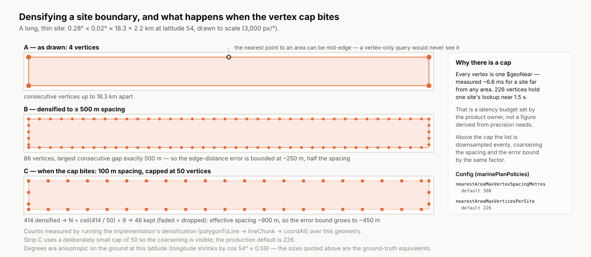
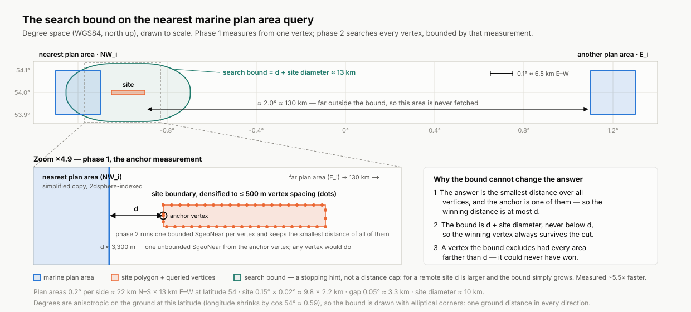

# Nearest marine plan area fallback

When a marine licence is submitted, a background worker works out which marine
plan policies apply to it. This page explains what happens when that lookup
finds nothing, why the fallback that covers it is built the way it is, and how
to tell from the logs that it has run.

Section 1 assumes no knowledge of the codebase. Sections 2 onwards are for
developers and assume some MongoDB.

## 1. What this does and why

### The normal path

A marine licence has one or more **sites** — the places on the map where the
work will happen. England's waters are divided into **marine plan areas** (for
example North West Inshore, East Offshore), and each area carries its own set
of **policies** that an application in that area has to be assessed against.

Normally the service works out which policies apply by asking which plan areas
each site falls inside. This is a spatial intersect: site shape in, overlapping
areas out, policies attached.

### What goes wrong

Occasionally the intersect comes back with nothing at all, or with only `Land`
— the placeholder the policy dataset uses for onshore locations.

That rarely means the site genuinely sits outside every marine plan. Far more
often the plan area boundaries are slightly inaccurate near the coast, so a
site a short way offshore falls into a gap between the mapped coastline and the
mapped plan area. Without a fallback, the application ends up with no policies
attached at all, and a case officer has nothing to work from.

### What the fallback does

Instead of returning nothing, the service finds the marine plan area **nearest
to each site** and assigns that area's policies.

Only the area's **non-spatial** policies are assigned — the ones that apply
across the whole plan area. Spatial policies are tied to a specific shape
inside the area (a particular anchorage or cable corridor, say), and a site
that is outside the plan area is necessarily outside those shapes too, so they
cannot apply.

Distance is **uncapped**. This is a product decision: however far a site turns
out to be from the nearest area, that area's policies are still assigned. There
is no threshold beyond which the service gives up and returns nothing. Every
site's measured distance is written to the logs, so an implausibly distant
match is visible for review rather than silently dropped.

### What the fallback does not do

- It does not affect applications whose sites do intersect a plan area. It runs
  only when the intersect returns nothing, or returns only `Land`.
- It does not write anything to the database about itself. The policies it
  produces are stored in exactly the same way as intersect-derived ones. The
  only record that the fallback ran is a log line — see
  [section 4](#4-observability).
- It never modifies the full-resolution plan area data. The fallback works from
  a separate simplified copy; the original data is read-only to it.

A product owner can stop here. The rest of this page is about how the search is
made accurate enough and fast enough.

## 2. The decisions and their reasons

### 2.1 Edge distance, not centre distance

Distance is measured from the site's **boundary**, not from a representative
point inside it. This is a product requirement, and it matters for elongated
sites: a 10 km-long site with one end almost touching a plan area would be
scored several kilometres away if measured from its centre, and could be
matched to the wrong area entirely.

MongoDB's `$geoNear` only accepts a **point** as the origin, so the boundary is
represented by the points along it and the site's distance to an area is taken
as the smallest of its vertices' distances.

### 2.2 Densification to a maximum vertex spacing of 500 m

Site boundaries as drawn are sparse — often just four corners. The point on a
site nearest to a plan area is usually somewhere along an edge, not at a
corner, and a query that only looked at the stored vertices would never see it.

So before querying, each boundary is **densified**: extra vertices are
interpolated along it until no two consecutive vertices are more than 500 m
apart. The worst case is then a nearest point exactly midway between two
vertices, which bounds the edge-distance error at **half the spacing, ~250 m** —
far inside the plan boundary inaccuracy that motivates the fallback in the
first place.

Densification is composed from turf primitives: `polygonToLine` turns the
boundary into lines, `lineChunk` cuts them into pieces no longer than the
spacing, and `coordAll` collects every original and interpolated vertex.
Repeated coordinates — chunk endpoints and ring closing coordinates — are
de-duplicated.

### 2.3 The vertex cap of 226 is a latency budget, not a precision one

Densification alone is unbounded: a large or intricate site can produce
thousands of vertices, and every vertex costs one `$geoNear` — measured at
**~6.6 ms** for a site far from any area. At that rate 226 vertices hold a
single site's lookup near **1.5 s**, which is the operating budget the product
owner set for it.

That number is an explicit judgement call about latency, not a value derived
from any precision requirement, and it is adjustable in config.

When the cap bites, the vertex list is downsampled evenly — every Nth vertex is
kept, with `N = ceil(count / cap)`. This **coarsens** the spacing that
densification just established, and the error bound with it, both by the same
factor. The heaviest real site measured (548 vertices after densification) lands
on `N = 3`: 1,500 m effective spacing, so a ~750 m error bound rather than
~250 m.

Both values live in the `marinePlanPolicies` config:

| Key                                 | Default | Environment variable                                          |
| ----------------------------------- | ------- | ------------------------------------------------------------- |
| `nearestAreaMaxVertexSpacingMetres` | `500`   | `MARINE_PLAN_POLICIES_NEAREST_AREA_MAX_VERTEX_SPACING_METRES` |
| `nearestAreaMaxVerticesPerSite`     | `226`   | `MARINE_PLAN_POLICIES_NEAREST_AREA_MAX_VERTICES_PER_SITE`     |

Raising the cap buys precision on large sites at a directly proportional cost
in latency.

### 2.4 A simplified copy of the plan areas, tolerance 0.001°

The published plan area geometry is very detailed — around 834,000 vertices
across all areas. Running the per-vertex query against it took **~74 s per
site**, which is unusable inside a queue worker.

The fallback therefore queries a **simplified copy** of the areas, rebuilt from
the source collection at every boot and reduced by Ramer–Douglas–Peucker
simplification at a tolerance of **0.001° (~111 m)**. That cuts the geometry to
around 18,000 vertices and the per-site query to tens of milliseconds.

The tolerance was chosen by sweeping it against real sites:

| Tolerance | Sites that chose a different area | Distance error              |
| --------- | --------------------------------- | --------------------------- |
| 0.001°    | **0 of 552**                      | 88 m at the 95th percentile |
| 0.002°    | 39 of 552                         | up to 14.6 km               |

0.002° collapses geometry badly enough to change the answer, so 0.001° is not a
value to nudge casually. It is hardcoded rather than configurable, and it is
encoded in the collection name — `marine-plan-areas-simple-0001`. The tolerance
constant and the collection name change **only together**, in the same change,
dropping the old collection, so the name can never disagree with the contents.

Two further details of the rebuild:

- The original `marine-plan-areas` collection is **never modified**. The
  submission-time intersect path depends on its full fidelity.
- Simplification can introduce self-intersections, which a `2dsphere` index
  rejects, so each simplified geometry is normalised with a zero-width buffer
  before insert — the same normalisation the loader applies. If simplification
  or that repair collapses a geometry, the area is kept at full fidelity and a
  warning is logged.

### 2.5 A self-derived search bound

The per-vertex query is bounded by a distance derived from the site itself at
runtime. It provably cannot change any result, and it was measured **~5.5×**
faster. [Section 3](#3-how-the-search-bound-works) explains why the guarantee
holds.

### 2.6 From plan area to policy codes

The nearest area's `regionref` (for example `NW_i`, `NW_o`) is turned into a
policy-code prefix by convention rather than by lookup table: take everything
before the first underscore and append a hyphen, so both `NW_i` and `NW_o`
derive `NW-`. Non-spatial policies are then filtered by an anchored
starts-with match against that prefix.

The trailing hyphen and the anchoring are what keep it safe: `S-` cannot match
`SE-…` or `SW-…`, and `E-` cannot match `NE-…`. A future conforming region is
covered automatically, and a prefix that matches nothing is reported as a
data-quality warning rather than passing silently.

## 3. How the search bound works

Running an unbounded `$geoNear` from every vertex makes the index expand
outwards across empty ocean until it finds something, once per vertex. The
query avoids most of that in two phases.

**Phase 1** runs a single **unbounded** `$geoNear` from one vertex. It returns
the nearest area to that vertex, at distance _d_.

**Phase 2** runs the full per-vertex aggregation with
`maxDistance = d + site diameter`, and takes the global minimum over all
vertices.

The bound cannot change the answer:

- The result is the smallest distance across every vertex, and the phase-1
  vertex is one of the vertices being searched. So the winning distance is **at
  most _d_**.
- The bound is _d_ + the site's diameter, which is never below _d_. The vertex
  that ultimately wins therefore always survives the cut.
- Any vertex the bound does exclude had **every** area farther away than _d_,
  so it could never have produced the minimum. Excluding it provably cannot
  change the answer; it only spares the index a fruitless expansion.

The diameter term is headroom rather than load-bearing — the bound would still
be correct at exactly _d_. It is deliberately **not** justified as a span across
the site's bounding box: densified vertices follow great-circle paths that bulge
slightly outside that box, so an argument resting on the bounding box would not
be exact. The global-minimum argument above does not depend on the box at all.

This is a **stopping hint, not a distance cap**. Nothing is ever excluded from
the result for being far away: for a remote site, _d_ is large and the bound
simply grows to match. The same code comment in `nearest-marine-plan-area.js`
carries this argument, and the two should stay consistent.

## 4. Observability

Nothing about the fallback is persisted, so **the log is the record**. It is
deliberately loud: every path through it, successful or not, emits a `warn`
with an ECS `event.action`.

| `event.action`                             | `event.outcome` | Meaning                                                                                                                                                                              | `event.reference`                                            |
| ------------------------------------------ | --------------- | ------------------------------------------------------------------------------------------------------------------------------------------------------------------------------------ | ------------------------------------------------------------ |
| `mp-policies:nearest-neighbour-fallback`   | `success`       | The fallback ran and assigned policies. This is the provenance record, and a data-quality signal about plan boundary accuracy near those sites.                                      | licence id, site coverage, and per-site `regionref@distance` |
| `mp-policies:nearest-neighbour-cannot-run` | `failure`       | The fallback could not produce an answer. Either the simplified collection or its `2dsphere` index is missing, or no site yielded an area. The licence completes with zero policies. | the simplified collection name, or the licence id            |
| `mp-policies:region-prefix-no-match`       | `failure`       | A derived policy-code prefix matched no non-spatial policies — the `regionref`/policy-code naming convention has drifted, and the data owners need telling.                          | licence id and the unmatched prefix                          |
| `mp-policies:site-geometry-invalid`        | `failure`       | One site's stored geometry could not be turned into vertices, or carries a coordinate outside the valid longitude/latitude range. That site is skipped; the others continue.         | the site name                                                |

Two things worth knowing when reading these:

- The provenance line reports site coverage as `n/m sites`, because an
  individual site can be skipped without the whole fallback failing. A partial
  result is distinguishable from a full one from that single line.
- Distance is reported per site, rounded to the metre. A large distance is the
  signal that either the plan boundaries or the site data deserve a look.

## 5. Where the code lives

| Path                                                                               | Responsibility                                                    |
| ---------------------------------------------------------------------------------- | ----------------------------------------------------------------- |
| `src/marine-licences/api/helpers/marine-plan-policies/nearest-area-fallback.js`    | Trigger condition, orchestration across sites, provenance logging |
| `src/marine-licences/api/helpers/marine-plan-policies/nearest-marine-plan-area.js` | The two-phase query, the search bound, and geometry guards        |
| `src/marine-licences/api/helpers/marine-plan-policies/site-vertices.js`            | Densification, the vertex cap, and the site diameter              |
| `src/marine-licences/api/helpers/marine-plan-policies/region-prefix.js`            | `regionref` → policy-code prefix, and prefix filtering            |
| `src/marine-licences/api/helpers/marine-plan-policies/arcgis-client.js`            | `queryNonSpatialPolicies` — the attribute-only ArcGIS query       |
| `src/shared/plugins/geo-areas/simplify-marine-plan-areas.js`                       | The startup rebuild of the simplified collection                  |
| `src/config/marine-plan-policies.js`                                               | The spacing and vertex-cap settings                               |
| `src/marine-licences/constants/marine-licence.js`                                  | The `event.action` values listed above                            |
